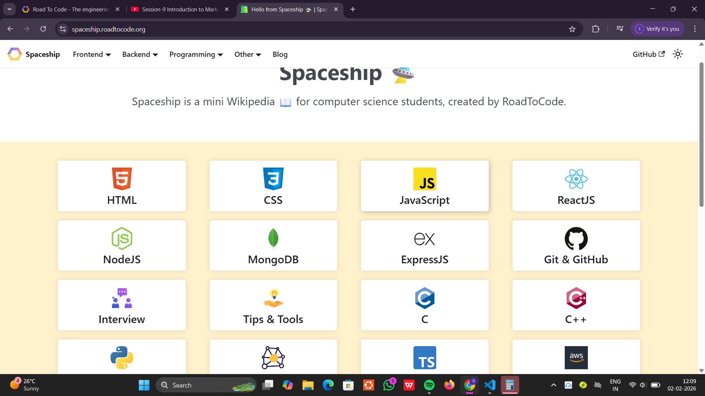

# spaceship 

welcome to rodetocode handbook! this is a open-source project serves as a handbook for various technologies and programming languaes taugh in rodetocode courses.

weather you are computer science student or coding ethusiast this repository will be your go to resource for all the things related to c, c++,javascript, reactJS,nodeJS,mongoDB and expressJS.

## How to contribute

we welcome contribution from the community to help us expand and improve this handbook. 